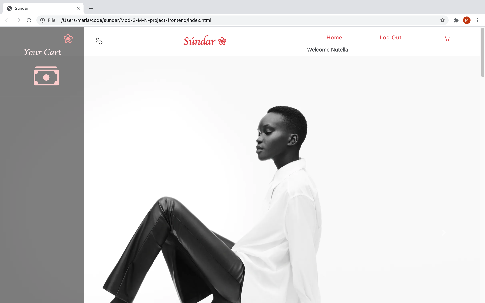

## Sundar Frontend

This is the frontend repo of Sundar, an e-commerce app for women's accessories.

### Tech Stack

* Vanilla Javascript
* Ruby on Rails API
* PostgreSQL DB

### Clone the repo, cd into the folder and run the following command to start the app.

* open index.html

[Backend Repo](https://github.com/21shield/Mod-3-MN-backend)
