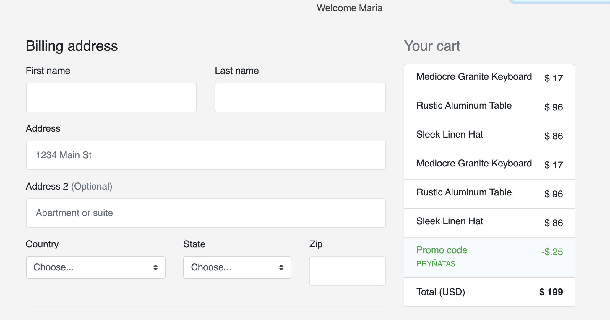

# 

# 
## Sundar Frontend

This is the frontend repo of Sundar, an e-commerce app for women's accessories. Sundar means Beautiful in Hindi.

### Prerequisites

1. Install the [Sundar Rails Backend API](https://github.com/21shield/Mod-3-MN-backend)
### Media
Add Items  |  View Cart | Purchase Items
:-------------------------:|:-------------------------:|:-------------------------:
  |   |

### Tech Stack

* Vanilla Javascript
* Ruby on Rails API
* PostgreSQL DB
* HTML/CSS

### Starting the Frontend
1. Clone this repository and `cd` into the directory
2. Start the Frontend server using `open index.html`

[Backend Repo](https://github.com/21shield/Mod-3-MN-backend)

[Go To Top](#Sundar)
